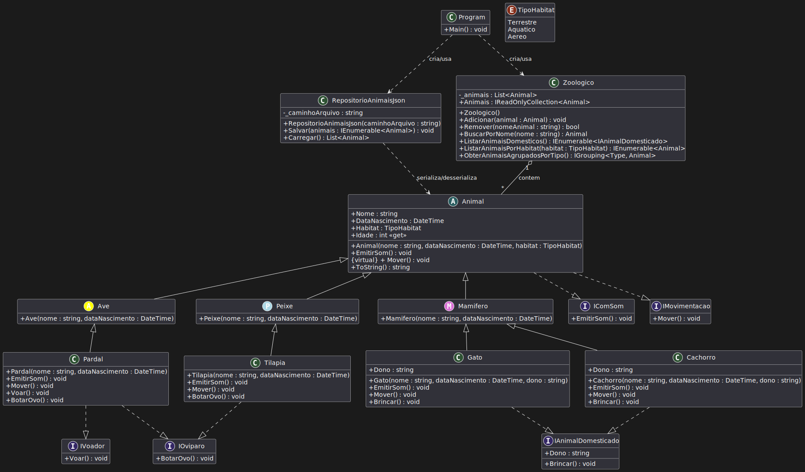

# Sistema de Zoológico - Demonstração de POO com .NET


Este projeto é uma aplicação de console desenvolvida em C# e .NET para demonstrar de forma prática os principais conceitos da **Programação Orientada a Objetos (POO)**. O sistema simula o gerenciamento de animais em um zoológico, aplicando princípios de herança, polimorfismo, abstração e encapsulamento.

## Objetivo

O objetivo principal é servir como um material de estudo e portfólio, mostrando a aplicação de boas práticas de desenvolvimento de software em um cenário simples e compreensível. O projeto inclui a persistência de dados em arquivos JSON, uma abordagem moderna e comum em muitas aplicações.

## Funcionalidades

*   **Cadastro de Animais:** Permite adicionar diferentes tipos de animais (mamíferos, aves, peixes).
*   **Listagem e Consulta:** Visualiza todos os animais, filtra por habitat, busca por nome, etc.
*   **Interação Polimórfica:** Executa ações genéricas como `EmitirSom()` e `Mover()`, onde cada animal se comporta de sua maneira específica.
*   **Persistência de Dados:** Salva o estado do zoológico em um arquivo `animais.json` e o carrega ao iniciar a aplicação.
*   **Estrutura Organizada:** O código é separado por responsabilidades (domínio, repositório, aplicação).

## 🏛️ Conceitos de POO Demonstrados

O projeto foi estruturado para destacar os seguintes pilares da POO:

1.  **Abstração:**
    *   Uso de classes abstratas (`Animal`, `Mamifero`) que definem um contrato base sem fornecer uma implementação completa, forçando as subclasses a implementarem seus próprios comportamentos.

2.  **Encapsulamento:**
    *   Proteção dos dados internos das classes, como a lista `_animais` na classe `Zoologico`, que só pode ser acessada através de métodos públicos (`Adicionar`, `Remover`).

3.  **Herança:**
    *   Criação de uma hierarquia de classes, onde classes mais específicas (`Cachorro`, `Gato`) herdam características e comportamentos de classes mais genéricas (`Mamifero`, `Animal`).

4.  **Polimorfismo:**
    *   Capacidade de tratar objetos de diferentes classes (`Gato`, `Pardal`, `Tilapia`) de maneira uniforme através da classe base `Animal`. Por exemplo, ao percorrer a lista de animais e chamar o método `EmitirSom()`, cada animal responde de acordo com sua implementação específica.

5.  **Interfaces:**
    *   Uso de interfaces (`IAnimalDomesticado`, `IVoador`) para definir contratos de comportamento que podem ser implementados por classes de diferentes galhos da árvore de herança, promovendo flexibilidade e desacoplamento.

## 🛠️ Tecnologias Utilizadas

*   **Linguagem:** C# 10+
*   **Plataforma:** .NET 6+
*   **Serialização:** `System.Text.Json` (biblioteca nativa do .NET para manipulação de JSON)

## Como Executar o Projeto

1.  **Pré-requisitos:**
    *   [.NET SDK 6.0 ou superior](https://dotnet.microsoft.com/download ) instalado.

2.  **Clone o repositório:**
    ```bash
    git clone https://github.com/seu-usuario/seu-repositorio.git
    cd seu-repositorio
    ```

3.  **Execute a aplicação:**
    ```bash
    dotnet run
    ```
    A aplicação iniciará no console, carregando os animais do arquivo `animais.json` (se existir ) e exibindo o menu de opções.

## UML - Diagrama de Classes

O diagrama abaixo representa a arquitetura do sistema, mostrando a relação entre as classes, interfaces e a estrutura de herança.



---
## Próximos Passos e Contribuições

Este projeto é um ponto de partida. Sinta-se à vontade para fazer um *fork* e implementar novas funcionalidades! Algumas ideias:

*   Implementar testes unitários para as classes de domínio.
*   Evoluir a persistência para um banco de dados com Entity Framework Core.
*   Criar uma API Web com ASP.NET Core para expor as funcionalidades.
*   Desenvolver uma interface de usuário com Blazor ou MAUI.
